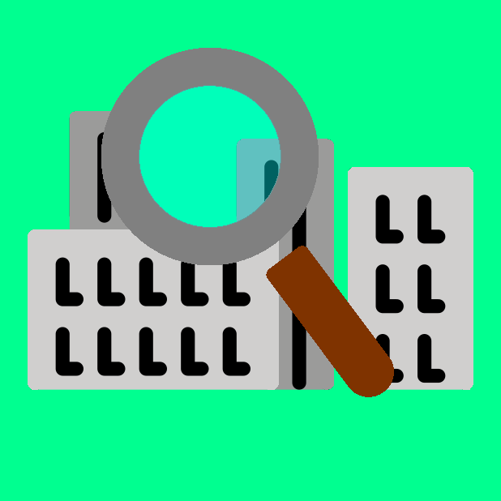

# UrbanResourceFinder

This project is based on [UrbanScout](https://github.com/Convenient-Coders/UrbanScout). 

UrbanResourceFinder is built from scratch and doesn't use any code found in the UrbanScout repository.

UrbanResourceFinder(URF) is a web application that provides locations to your nearest public necessities. At the moment these include water fountains, Wi-Fi hotspots, and recycling bins. More will be added in the future.

Website Link:

https://pokelegocuber.github.io/UrbanResourceFinder/

Built with:

[BootStrap](https://getbootstrap.com/)

[NYC Open Data](https://opendata.cityofnewyork.us/)

[Leaflet](https://leafletjs.com/)

Assets were provided by:

[OpenStreetMap](https://www.openstreetmap.org/)

[OpenMoji](https://openmoji.org/)

[WikiMedia](https://commons.wikimedia.org/wiki/File:Blank_US_Map_(states_only).svg)

